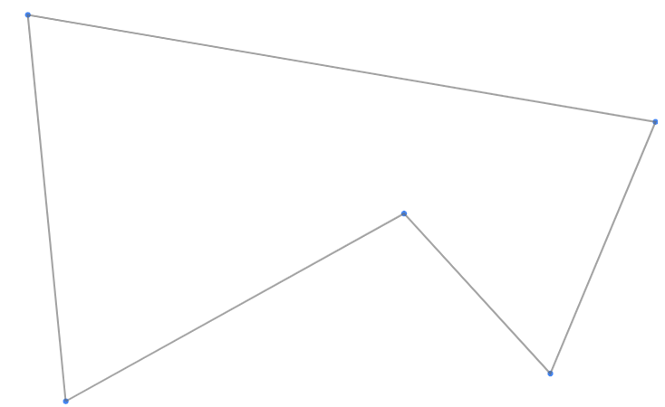
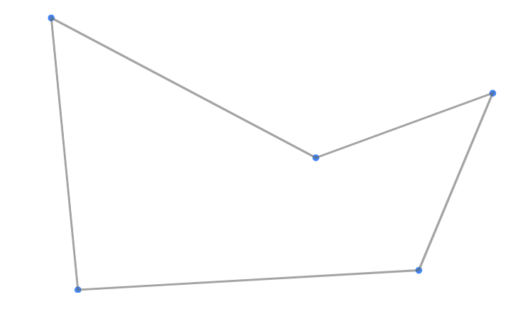
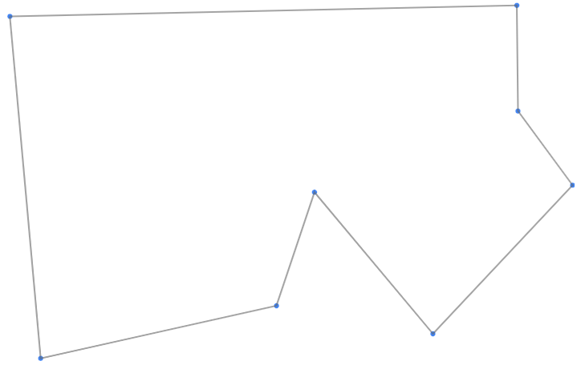
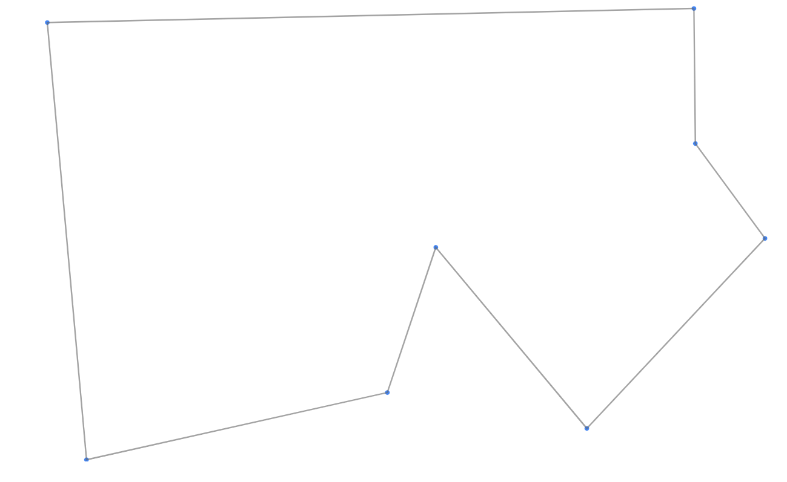
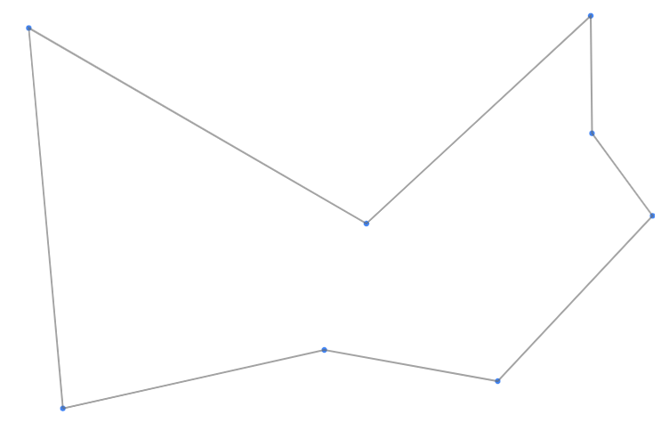
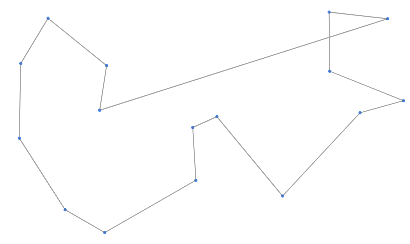
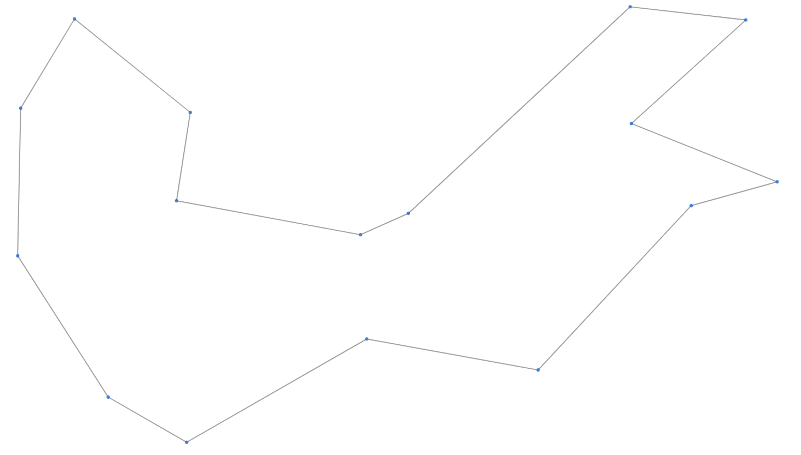
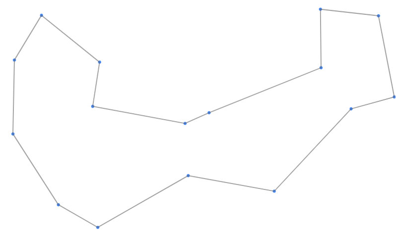

# Google STEP 2026: Travelling Salesperson Problem Challenges

Originally By: [Hayato Ito](https://github.com/hayatoito) (hayato@google.com)  
2020-2026 Versions By: [Hugh O'Cinneide](https://github.com/hkocinneide)
(hughoc@google.com), [Hiromu Ikeda](https://github.com/rombot98) (hiromu@google.com) and [Ayaka Kinoshita](https://github.com/oribe1115) (oribe@google.com)

## Quick Links

- [Scoreboard]

[scoreboard]:
  https://docs.google.com/spreadsheets/d/1uOhewb9KtMENU5AyLF8VcsyosQGOfkeh-Kka8M-DYcI/edit?usp=sharing&resourcekey=0-w2dZASN1e-X_gcl8vicB4Q
[github issues]: https://github.com/hayatoito/google-step-tsp/issues

## Problem Statement

In this assignment, you will design an algorithm to solve a fundamental problem
faced by every travelling salesperson, called _Travelling Salesperson Problem_
(TSP). I’ll explain TSP in the onsite class. TSP is very famous problem. See
[Wikipedia](http://en.wikipedia.org/wiki/Travelling_salesman_problem). You can
understand the problem without any difficulties.

Quoted from
[Wikipedia](http://en.wikipedia.org/wiki/Travelling_salesman_problem):

> The travelling salesman problem (also called the travelling salesperson problem or TSP) 
> asks the following question: Given a list of cities and the distances between each pair 
> of cities, what is the shortest possible route that visits each city exactly once and 
> returns to the origin city?

# How I solved

### Greedy
- [solver_greedy.py](solver_greedy.py)

The tour is generated using a greedy algorithm.

<b>Algorithm</b>

A straightforward method that continuously selects the closest unvisited city from the current city.

fast and simple algorithm .
However , because it only focuses on immediate optimal choices, it often leaves distant cities isolated at the end. Connecting these remaining cities usually results in a massive distance penalty (highly prone to falling into local optima). 

---

### Greedy + 2-opt
- [solver_greedy2opt.py](solver_greedy2opt.py)

The initial solution is generated using a greedy algorithm and then improved using 2-opt optimization.

<b>Algorithm</b>

A technique that untangles crossed paths (edges) in the initial route created by the greedy algorithm. It cuts two edges in the route and reconnects them in a different order, keeping the change only if the total distance decreases.

- By repeating this process until no more crossings exist (i.e., no further improvements can be made), the quality of the initial solution improves dramatically. However, it cannot fix fundamental structural flaws or large, inefficient detours in the overall route.

---

### Greedy + 2-opt + SA (Simulated Annealing)
- [solver_greedy2optSA.py](solver_greedy2optSA.py)

The initial solution is generated using a greedy algorithm and then improved using 2-opt optimization combined with Simulated Annealing to escape local optima.  [Reference](https://qiita.com/take314/items/7eae18045e989d7eaf52)

<b>Algorithm</b>

An algorithm mimicking the physical process of annealing, where metals form neat, strong crystals when heated and slowly cooled. During the local search (2-opt), it occasionally accepts changes that **increase the distance (worsen the route)** based on a calculated probability.

- **Temperature Parameter:** In the early stages (high temperature), it frequently allows worsening changes to explore the search space. In the later stages (low temperature), it becomes strict and only accepts improvements.
- Even if the algorithm gets trapped in a strong local optimum (a "trap" route), accepting temporary deterioration allows it to escape on its own and eventually find a much better global solution.

---

### Greedy + 3-opt + GA (Genetic Algorithm)
- [solver_greedy3optGA.cpp](solver_greedy3optGA.cpp)

The initial population is generated using greedy algorithms from diverse starting cities. These solutions are evolved through a Genetic Algorithm, with each child fully optimized by rigorous local search (Memetic Algorithm).

<b>Algorithm</b>

A method that mimics biological evolution by combining multiple "excellent routes (individuals)" to create even better offspring in the next generation.

- **Ensuring Diversity:** Maintains a population of various high-quality initial solutions by starting the greedy algorithm from different cities.
- **Crossover:** Creates new routes by cutting and pasting good segments from two parent routes (e.g., using Order Crossover).
- **Memetic Algorithm (Local Search Integration):** Immediately applies rigorous 2-opt or 3-opt to the newly generated offspring, pushing them to their absolute limits before they join the population. This "education" of the offspring yields far higher accuracy than relying solely on single-route improvements.

---

# Result of Visualizer

## Homework 5

## Challenge 0

| Method | Result | Total Distance
|--------|--------|--------|
| Random  |  | 3862.2 m 
| Greedy  |  | 3418.1 m
| Greedy-2opt |  | 3291.62 m 
| Greedy-2opt + SA |  | 3291.62 m 

## Challenge 1

| Method | Result | Total Distance
|--------|--------|--------|
| Random  |  | 6101.57 m 
| Greedy  |  | 3832.29 m
| Greedy-2opt|  | 3832.29 m
| Greedy-2opt + SA |  | 3778.72 m

## Challenge 2

| Method | Result | Total Distance
|--------|--------|--------|
| Random  |  | 13479.25 m
| Greedy  |  | 5065.58 m
| Greedy-2opt |  | 4670.27 m
| Greedy-2opt + SA |  | 4494.42 m

## Result of Greedy-2opt + SA (Best result of Homework 5)

Path length for each challenge:

| Challenge | Path length (m) |
|------------|----------------|
| 0 | 3291.62 |
| 1 | 3778.72 |
| 2 | 4494.42|
| 3 | 8565.05 |
| 4 | 11266.78  |
| 5 | 25331.84 |
| 6 | 49892.05 |

# Homework 6 (optimizing solver with Gemini )

## Result of Greedy-3opt + GA

Path length for each challenge:

| Challenge | Path length (m) |
|------------|----------------|
| 6 | Calcurating |
| 7 |  81143.2 |

## What’s included in the assignment

To help you understand the problem, there are some sample scripts / resources in
the assignment, including, but not limited to:

- `solver_random.py` - Sample stupid solver. You never lose to this stupid one.
- `sample/random_{0-6}.csv` - Sample output files by solver_random.py.
  this definitely.
- `sample/sa_{0-6}.csv` - Yet another sample output files. I expect all of you
  will beat this one too. The solver itself is not included intentionally.
- `output_{0-6}.csv` - You should overwrite these files with your program's
  output.
- `output_verifier.py` - Try to validate your output files and print the path
  length.
- `input_generator.py` - Python script which was used to create input files,
  `input_{0-6}.csv`
- `visualizer/` - The directory for visualizer.

Details are intentionally omitted here. It is your responsibility to understand
the contents of the repository.

